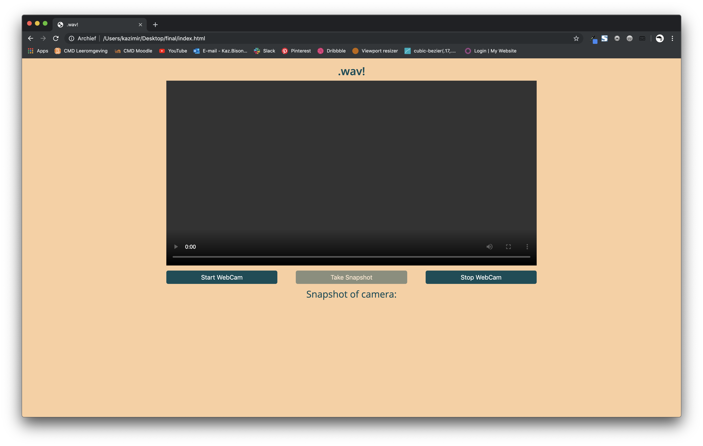

# How to Build .wav!

* [View demo .wav!](final/index.html/ "View demo .wav!")
* [Source code](final/ "Source code")

> **Note that te demo doesn't work. Below we'll explain why**

## Prerequisites

* Basic knowledge of HTML and CSS
* Basic knowledge of JavaScript syntax and datatypes
* Basic knowledge of working with JSON and JavaScript objects

It will look like this:



Let's get started.

## Setting Up

We're going to start by creating an index.html file in a new directory. The project will consist of index.html, style.css, and scripts.js at the end. This HTML and CSS file are complete and will not change. We'll be using JavaScript to add everything from here out.

### index.html

```html
<!DOCTYPE html>
<html lang="en">

<head>
    <meta charset="UTF-8">
    <title>.wav!</title>
    <meta name="viewport" content="width=device-width, initial-scale=1">
    <script src="https://ajax.googleapis.com/ajax/libs/jquery/1.9.0/jquery.min.js"></script>
    <link rel="stylesheet" href="styles/style.css">
</head>

<body>

    <h1>.wav!</h1>
    <video id="video" controls autoplay></video>
    <div>
        <button onclick="startWebcam();">Start WebCam</button>
        <button id="takeSnap" disabled>Take Snapshot</button>
        <button onclick="stopWebcam();">Stop WebCam</button>
    </div>

    <div>
        <h2>Snapshot of camera:</h2>
        <canvas id="sourceImage"></canvas>
        
        <pre id="responseArea"></pre>
        <audio id="sourceAudio" controls src=""></audio>
    </div>

    <script type="text/javascript" src="js/script.js"></script>

</body>

</html>
```

### style.css

```css
@import url('https://fonts.googleapis.com/css?family=Open+Sans:300,300i,400,400i,600,600i,700,700i,800,800i&display=swap');

* {
    margin: 0;
    padding: 0;
    box-sizing: border-box;
}

body {
    background: #FACF9F;
    color: #000;
    font-family: 'Open Sans', sans-serif;
    font-size: 16px;
    font-weight: 300;
    padding: 0.5em 0.5em 4em 0.5em;
}

h1 {
    color: #0A4D58;
    font-size: 1.75em;
    font-weight: 600;
    text-align: center;
    line-height: 1.75em;
}

h2 {
    color: #0A4D58;
    font-size: 1.5em;
    font-weight: 400;
    text-align: center;
    line-height: 1.5em;
    margin-bottom: 1em;
}

label {
    display: block;
}

body div:first-of-type {
    display: flex;
    justify-content: space-between;
    width: 100%;
}

input,
button {
    margin: .5em 0;
    padding: .5em;
    border-radius: .3em;
    width: 30%;
}

input {
    display: block;
    font-size: 1em;
}

button {
    font-size: 1em;
    background: #0A4D58;
    color: white;
    border: none;
}

button:disabled {
    opacity: .5;
}

#video {
    width: 100%;
}

img {
    width: 100%;
    display: block;
}

canvas {
    display: block;
    margin: 0 auto;
    margin-bottom: 1em;
    width: 100%;
}

.hidden {
    display: none;
}

pre {
    color: #0A4D58;
    font-family: 'Open Sans', sans-serif;
    font-size: 1.5em;
    font-weight: 400;
    text-align: center;
    text-transform: capitalize;
    margin-bottom: 1em;
}

audio {
    display: block;
    width: 100%;
}

@media (min-width: 31em) {

    audio {
        max-width: 30em;
        margin: 0 auto;
    }

}

@media (min-width: 60em) {

    body {
        margin: 0 auto;
        max-width: 60em;
        padding-bottom: 6em;
    }

}
```

Now that we have the HTML and CSS set up, you can make scripts.js and we'll continue from there.

## script.js

This webapp is based on code from [Sonja Rouwhorst](tutorial%20by%20sonja%20rouwhorst/voorbeeld-webcam.html/ "The code this webapp is based upon"). Go ahead and take a look, if you want to, so you get to know which code we've replaced with the code we're showing you in this manual.

To start of we need to link to the right to get the right set of JSON back from Microsoft Azure.

> **Note that the code won't work if you don't put your own subscription key.** [Link to Microsoft Azure](https://azure.microsoft.com/ "Link to Microsoft Azure").

```javascript
var subscriptionKey = "PUT YOUR SUBSCRIPTION KEY HERE";
var endpoint = "https://westeurope.api.cognitive.microsoft.com/";
var uriBase = endpoint + "vision/v2.0/analyze";
var webcamStream;
```

For this next step we're going to request the right set of the JSON we get back from Microsoft.

```javascript
// Request parameters.
var params = {
    "visualFeatures": "Objects",
    "details": "",
    "language": "en",
};
```

Go ahead and create a function `showResults()` with a parameter `json` all the way at the bottom. This function is going contain javascript that sends the information you've requested from Microsoft to the `index.html`.

```javascript
function showResults(json) {

}
```

First thing you're going to do in the function `showResults()` is `hiding the spinner animation`, which shows when the web-app is requesting the information.

```javascript
document.querySelector('#spinner').classList.add('hidden');
```

Below that we're going to create a `var` called 'stringLB' which is going to store the the right object from the JSON we requested. If we had injected the content stored `stringLB` a HTML element right away the name of the animal would be inside `""`. Thats why we created another `var` named `stringLBtrimmed`. Which strips the animal name form its `""`.

```javascript
var stringLB = JSON.stringify(json.objects[0].object);
var stringLBtrimmed = stringLB.substr(1, stringLB.length - 2);
```

Now we're going to insert the content in the HTML element that we gave an ID named `#responseArea` using `textContent`.

```javascript
document.querySelector('#responseArea').textContent = stringLBtrimmed;
```
To complete the final two lines of the tutorial we're going to give the HTML element `audio` its rigthful `src`. Still using the same `var` we used to display the name of the animal in the `#responseArea`.
First we're going to select `audio` by using `document.getElementById("sourceAudio")`. Now that the audio element is saved in `var sourceAudio` we can give `sourceAudio` the source `'./audio/' + stringLBtrimmed + '1.wav'`. Which translates to `'./audio/animalName1.wav'`.

> **Make sure to [download the animal sounds](final/audio/ "Location of sound files on our Github") from our Github repository.**
> It's also possible to download animal sounds yourself. Just make sure the sound file is a `.wav` and its named right. For instance `giraffe1.wav`.

```javascript
var sourceAudio = document.getElementById("sourceAudio");
sourceAudio.src = './audio/' + stringLBtrimmed + '1.wav';
```

If you followed the steps correctly your function `showResults()` will look like this.

```javascript
function showResults(json) {

    document.querySelector('#spinner').classList.add('hidden');

    var stringLB = JSON.stringify(json.objects[0].object);
    var stringLBtrimmed = stringLB.substr(1, stringLB.length - 2);

    document.querySelector('#responseArea').textContent = stringLBtrimmed;

    var sourceAudio = document.getElementById("sourceAudio");
    sourceAudio.src = './audio/' + stringLBtrimmed + '1.wav'

}
```

And we're done! Here is the final **scripts.js** code.

```javascript
// **********************************************
// *** Update or verify the following values. ***
// **********************************************

var subscriptionKey = "PUT YOUR SUBSCRIPTION KEY HERE";
var endpoint = "https://westeurope.api.cognitive.microsoft.com/";
var uriBase = endpoint + "vision/v2.0/analyze";
var webcamStream;

// Request parameters.
var params = {
    "visualFeatures": "Objects",
    "details": "",
    "language": "en",
};

// *****************************************************************************
// *** function startWebcam                                                  ***
// *** ask permision from user and start webcam, then                        ***
// *** enable the button to take a snapshot                                  ***
// *****************************************************************************

function startWebcam() {
    var vid = document.querySelector('video');
    // request cam
    navigator.mediaDevices.getUserMedia({
            video: true
        })
        .then(stream => {
            // save stream to variable at top level so it can be stopped lateron
            webcamStream = stream;
            // show stream from the webcam on te video element
            vid.srcObject = stream;
            // returns a Promise to indicate if the video is playing
            return vid.play();
        })
        .then(() => {
            // enable the 'take a snap' button
            var btn = document.querySelector('#takeSnap');
            btn.disabled = false;
            // when clicked
            btn.onclick = e => {
                takeSnap()
                    .then(blob => {
                        analyseImage(blob, params, showResults);
                    })
            };
        })
        .catch(e => console.log('error: ' + e));
}

// *****************************************************************************
// *** function takeSnap                                                     ***
// *** show snapshotimage from webcam                                        ***
// *** convert image to blob                                                 ***
// *****************************************************************************

function takeSnap() {

    // get video element
    var vid = document.querySelector('video');
    // get canvas element
    var canvas = document.querySelector('canvas');
    // get its context
    var ctx = canvas.getContext('2d');
    // set its size to the one of the video
    canvas.width = vid.videoWidth;
    canvas.height = vid.videoHeight;
    // show snapshot on canvas
    ctx.drawImage(vid, 0, 0);
    // show spinner image below
    document.querySelector('#spinner').classList.remove('hidden');
    return new Promise((res, rej) => {
        // request a Blob from the canvas
        canvas.toBlob(res, 'image/jpeg');
    });
}

// *****************************************************************************
// *** function stopWebcam                                                   ***
// *** stop webcam                                                           ***
// *** disable snapshot button                                               ***
// *****************************************************************************

function stopWebcam() {
    var vid = document.querySelector('video');
    vid.srcObject.getTracks().forEach((track) => {
        track.stop();
    });
    // disable snapshot button
    document.querySelector('#takeSnap').disabled = true;
}

// *****************************************************************************
// *** function analyseImage                                                 ***
// *** analyse image using cognitive services of Microsoft                   ***
// *** img - image to analyse                                                ***
// *** params - object containing params to send                             ***
// *** processingFunction - name of function to call to process the response ***
// *****************************************************************************

function analyseImage(image, params, proccessingFunction) {

    // create API url by adding params
    var paramString = Object.entries(params).map(([key, val]) => `${key}=${val}`).join('&');
    var urlWithParams = uriBase + "?" + paramString;

    // do API call
    fetch(urlWithParams, {
            method: "POST",
            headers: {
                "Content-Type": "application/octet-stream",
                "Ocp-Apim-Subscription-Key": subscriptionKey
            },
            processData: false,
            body: image,
        })
        // then turn response into json
        .then(response => response.json())
        // then go to processingFunction
        .then(json => proccessingFunction(json))
        // show alert window if something goes wrong
        .catch(error => alert(error.message));
}

// *****************************************************************************
// *** function showResults                                                  ***
// *** show results found by AI service                                      ***
// *** json - json response from AI                                          ***
// *****************************************************************************

function showResults(json) {

    // hide spinner image onto the canvas
    document.querySelector('#spinner').classList.add('hidden');

    var stringLB = JSON.stringify(json.objects[0].object);
    var stringLBtrimmed = stringLB.substr(1, stringLB.length - 2);

    // show results in responseArea
    document.querySelector('#responseArea').textContent = stringLBtrimmed;

    var sourceAudio = document.getElementById("sourceAudio");
    sourceAudio.src = './audio/' + stringLBtrimmed + '1.wav';

}
```

Here is what the final product looks like!


Again, here is a link to the demo and the source code.

* [View demo .wav!](final/index.html/ "View demo .wav!")
* [Source code](final/ "Source code")
